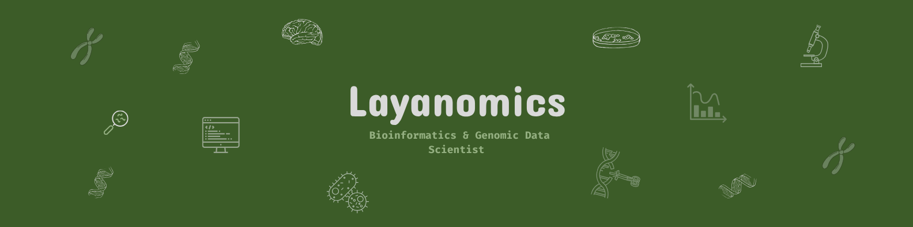

## 👩🏻‍🔬 Meet the Scientist

Hi, I'm **Layan**  
🧬 Bioinformatics & Genomic Data Scientist     
🎓 Data Science Postgraduate Student   
🔍 Insight Miner in Gene Expression     
📍 Jubail, Saudi Arabia   

---

## 🔬 Behind the Pipelines

During my BSc in Biotechnology & Biomolecular Chemistry, somewhere between pipetting samples and my first R script that made genes speak through statistics, I discovered my path in genomic data analysis.

I combined my background in biology with graduate-level studies in data science, focusing on statistics and machine learning. Now, I build pipelines and replicate published studies — from raw data to publication-ready figures.

---

## 💡My Niche in Bioinformatics  

- Bulk RNA-seq analysis (QC → DE → visualization)  
- Reproducing published transcriptomic studies  
- Statistical modeling of gene expression  
- Cloud-based bioinformatics workflows (GCP)  
- Reproducible, version-controlled scientific code  
- CRISPR-related differential expression analysis 

---

## 🔧 My Bioinformatics Toolkit

---

## 🌱 Concepts in Progress

- scRNA-seq and spatial transcriptomics
- Multi-omics Integration  
- Deep Learning for Genomics (CNNs, RNNs with Keras/PyTorch)  
- Building scalable workflows with Nextflow  

---

## 📫 Let’s Connect

- 💼 [LinkedIn](https://www.linkedin.com/in/layan-essam/)

---

> *“The greatest discoveries are often hidden in strings of A, T, G, and C.”* 🧬  

